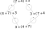

# Kommutativitet for multiplikasjon &ndash; detaljer.

Kommutativitet betyr (kun) at du kan bytte om operandene i enhver gitt bruk av en operasjon.

## Kommutativ + assosiativ = «faktorenes orden er likegyldig».

Kommutativitet for multiplikasjon brukte i hin hårde dager å bli forklart som «faktorenes orden er likegyldig», som jeg her vil kalle at multiplikasjon er **ordensuavhengig**.

Men ordensuavhengighet, som addisjon og multiplikasjon har, er ikke det samme som kommutativitet:

* en ordensuavhengig operasjon er nødvendigvis også kommutativ, men
* en kommutativ operasjon behøver ikke å være ordensuavhengig.

 For at operandenes orden skal være likegyldig, ordensuavhengigheten, må operasjonen være både kommutativ og **assosiativ**. «Assosiativ» betyr at du kan sette inn parenteser (gruppere), og ikke minst fjerne dem!, hvor du vil i en rekke av slike operasjoner. For eksempel at $2 + 3 + 4 = (2 + 3) + 4 = 2 + (3 + 4)$.

Litt oppkonstruert men kjekt å kjenne til eksempel. Hvis man definerer at symbolet «⊗» står for (dette er ikke en standard betydning) en operasjon der $a \otimes b = (a - 1) \cdot (b - 1)$, så er denne ganske kunstige operasjonen kommutativ men ikke assosiativ. Den er dermed ikke ordensuavhengig slik addisjon og multiplikasjon er: for «⊗» kan du ikke fritt endre rekkefølgen på operandene når der er tre eller flere.

Kommutativ: for eksempel, $7 \otimes 4 = 18 = 4 \otimes 7$.

Ikke assosiativ: for eksempel, $(7 \otimes 4) \otimes 3 = 34$, mens $7 \otimes (4 \otimes 3) = 30$.

Ekvivalente operand-rekkefølger fått med rene kommuteringer:

$\quad$ 

Mangelen på assosiativitet betyr at selv om man fritt kan bytte om operandene til en gitt forekomst av «⊗», slik som ovenfor, så kan man ikke fritt endre rekkefølgen av operander når der er tre eller flere: *man kan ikke fjerne parentesene*.

## Om ordet «kommutativ».

Assosieres med en rundtur, i matematikken en rundtur for to operander:

* [engelsk *commute*](https://dictionary.cambridge.org/dictionary/english/commute), å reise til og tilbake fra jobb;
* [norsk *kommutator*](https://snl.no/kommutator), en anordning som skifter retning på strømmen i elektromagnetene i en elektromotor.

«Kommutere» [fra latin *commutare* å forandre, å bytte om](https://naob.no/ordbok/kommutere).

## Om ordet «assosiativ».

I et regneuttrykk som $a + b$ er $a$ og $b$ operander mens $+$ er en operator.

Operandene er typisk tall, mens operatoren er et symbol som står for en operasjon.

Operatoren «−» (subtraksjon) er slik at $5-3-2$ skal tolkes som $(5-3)-2$. Og generelt at i en sekvens av subtraksjoner skal den til venstre utføres først. Det kalles at operatoren er **venstre-assosiativ**.

Altså, at forekomsten lengst til venstre i en sekvens, assosierer seg sterkest med og dermed knytter seg til operandene rundt seg, som om der er en parentes rundt denne delen.

Hvis man definerer «↑» som operator for potensering (Donald Knuths notasjon) slik at for eksempel $5↑3$ betyr $5^3$, så er det naturlig å definere den som **høyre-assosiativ** slik at for eksempel $5↑3↑2$ skal tolkes som $5↑(3↑2)$, og generelt at i en sekvens av potenseringer skal den til høyre utføres først. Både $5↑3↑2$ og $5^{3^2}$ står da for $5^{(3^2)} = 5^9 = 1\ 953\ 125$. Altså, den vanlige potenseringsnotasjonen er i en viss forstand også høyre-assosiativ.

Og altså, at forekomsten lengst til høyre i en sekvens, assosierer seg sterkest med og dermed knytter seg til operandene rundt seg, som om der er en parentes rundt denne delen.

Addisjon og multiplikasjon er slik at det ikke spiller noen rolle om man starter til venstre eller til høyre i en sekvens av kun addisjoner eller kun multiplikasjoner.

Det gir dermed ikke mening å si at operatorene «+» og «⋅» er venstre-assosiative eller høyre-assosiative. I stedet sier man at *operasjonen* er «assosiativ». Mulig måte å tenke på det på: at en operator for operasjonen assosierer like sterkt begge veier. Men så vidt jeg vet finnes det ingen god forklaring. Ordet er nesten det motsatte av det det står for. Det hadde etter min oppfatning vært klarere & mer meningsfylt å si at en slik operasjon er «ikke-assosiativ».
