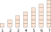

# Sum av fortløpende heltall

En heltallsrekke slik som tallene 1 til og med 7 kan presenteres og tenkes på visuelt ved å la hvert heltall stå for det antallet små kvadrater:

&nbsp;&nbsp;&nbsp;&nbsp;&nbsp;&nbsp;&nbsp;&nbsp;

Mer generelt kan dette være en heltallsrekke 1 til og med $n$, men plassen her strekker ikke til for for eksempel $n = 10\:000$; det konkrete eksemplet med $n = 7$ får holde.

Summen av tallene er nødvendigvis det totale antallet kvadrater. Altså arealet av søylene. En grei måte å se det arealet mer som et samlet areal er å legge søylene helt inntil hverandre:

&nbsp;&nbsp;&nbsp;&nbsp;&nbsp;&nbsp;&nbsp;&nbsp;

Her ser det ut til at arealet &ndash; altså summen &ndash; er omtrentlig halvparten av et kvadrat med sidelengde 7, det vil si rundt $7^2/2 = 24,5$. Men når det man håper er en sum av rene heltall får desimaler er det helt klart ikke presist, det er bare et ganske bra *estimat*. Det er imidlertid en helt symmetrisk figur, dette, som betyr at en kopi av den kan roteres 180 grader og legges på toppen, som gir et *rektangel* med et eksakt areal som er lett å regne ut:

&nbsp;&nbsp;&nbsp;&nbsp;&nbsp;&nbsp;&nbsp;&nbsp;

Siden det doble arealet er 56 må arealet for heltallsrekken selv, være 28. Eksakt. Og mer generelt, i stedet for dette konkrete eksemplets $\left(7 \cdot (7 + 1)\right)/2$ blir summen av heltallene 1 til og med $n = \left( n \cdot (n + 1) \right)/2 =$

$$\frac{n^2 + n}{2}$$

En grei matematisk måte å se det på er at summen er $n$ ganger *gjennomsnittet* $\frac{1  +  n}{2}$  av tallene , altså $n \cdot \left( (1 + n)/2 \right)$. Ja, det er samme formel. Bare et annet perspektiv.

Gjennomsnittet er jo definert å være summen av tallene dividert på antall tall.

---

Hva blir summen av partallene 2, 4, 6 osv. til og med $k$?

Den enkleste måten jeg ser å finne summen på er å si at disse tallene, og dermed summen, er det dobbelte av en forløpende rekke av heltall 1, 2, 3 osv. til og med $n$, der $n = k/2$.

Summen er dermed

$$
2 \cdot \frac{n^2 + n}{2} = n^2 + n
$$

&hellip; eller uttrykt med $k$,

$$
\begin{split}
n^2 + n & = k^2/4 + k/2 \\
& = \frac{k \cdot (k + 2)}{4}
\end{split}
$$

Det viser hvordan man kan bruke et tidligere resultat.

Alternativt går det an å gjøre det mer direkte ved å regne ut antall tall ganger gjennomsnittet.

---

Hva blir summen av oddetallene 1, 3, 5 osv. til og med $r$?

Antall tall blir $(r + 1)/2$. Eksempelvis, når $r = 5$ er der $6/2 = 3$ tall i rekken. Hva blir gjennomsnittet og summen?
