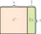
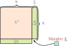

# Andregradsligning uten å bruke formel.

Ligningen

$\quad\quad \color{white}ax^2 + \color{black}bx + c = 0$

&hellip; gir $bx = -c$ og dermed $x = -c/b$, og ligningen

$\quad\quad ax^2 \color{white}+ bx \color{black}\ + c\ = 0$

&hellip; er bare ørlite mer komplisert: den gir $ax^2 = -c$, dermed $x^2 = -c/a$, slik at $x = \pm \sqrt{-c/a}$.

Men ligningen

$\quad\quad ax^2 + bx + c = 0$

&hellip; er verre fordi der nå er ***to*** forekomster av $x$, opphøyd i ulike potenser. Der er ikke noe enkelt grep som gir $x$ alene på én side av ligningen. Såfremt da ikke $a = 0$ eller $b = 0$, selvsagt.

Ligningen kan dog forenkles *litt* ved å dividere begge sider på $a$, som reduserer antall tall (kalt koeffisienter) i ligningen fra tre, nemlig $a$, $b$ og $c$, til to, nemlig $b/a$ og $c/a$:

$$
x^2 + \frac{b}{a}x + \frac{c}{a} = 0
$$

---

Hvis bare delen $x^2 + \frac{b}{a}x$ kunne uttrykkes som for eksempel kvadratet $(x + m)^2$, der $m$ er et passende tall, og der det bare er én forekomst av $x$, så ville alt ha vært så mye mye greiere! Trekk så fra $\frac{c}{a}$ på begge sider av ligningen, ta kvadratroten på begge sider, og vips så har man en enkel lineær ligning, kjent stoff. Men hvordan?

$x^2 + \frac{b}{a}x$ er et *rektangel* som inneholder et *kvadrat*, nemlig $x^2$:

$\quad\quad$ 

For å få det hele mer kvadratisk &ndash; i retning av det ønskede $(x + m)^2$ &ndash; kan strimen $\frac{b}{a}x$ til høyre splittes på langs, der den ytre halvdelen flyttes til under $x^2$-kvadratet:

$\quad\quad$ 

Etter flyttingen av den avkuttede strimen mangler det nå bare et lite hjørne, nede til høyre, på å ha et fullstendig kvadrat på formen $(x + m)^2$.

Arealet av hjørnet er $\left(\frac{b}{2a}\right)^2$. Og det betyr at hvis to-*x*-ers $x^2 + \frac{b}{a}x$ erstattes med singel-*x*-ers $\left(x + \frac{b}{2a}\right)^2$ så blir verdien i denne delen av ligningen $\left(\frac{b}{2a}\right)^2$ *for mye*. Men det kan jo kompenseres ved å også trekke fra akkurat så mye, som gir

$$(x + \frac{b}{2a})^2 - (\frac{b}{2a})^2 + \frac{c}{a} = 0$$

Dette grepet kalles **å fullføre kvadratet**, nemlig å legge til den lille biten som mangler i det utvidede kvadratet med sidelengde $x + \frac{b}{2a}$, og å altså kompensere det ved å også trekke fra akkurat så mye i resten av ligningen.

Videre manipulering av ligningen gir så den vanlige formelen for andregradsligninger:

$$
\begin{align*}
(x + \frac{b}{2a})^2 - (\frac{b}{2a})^2 + \frac{c}{a} & = 0 \\
& \Updownarrow \\
(x + \frac{b}{2a})^2 & = \frac{b^2}{4a^2} - \frac{4ac}{4a^2} \\
& \Updownarrow \\
x + \frac{b}{2a} & = \pm \frac{ \sqrt{ b^2 - 4ac }}{2a} \\
& \Updownarrow \\
x  & = \frac{ -b \pm \sqrt{ b^2 - 4ac }}{2a} \\
\end{align*}
$$

Med litt bedre kjennskap til LaTeX og GitHub sin variant hadde jeg kanskje klart å få dette venstrejustert, men det er sent på natten så&hellip;

---

Er dette virkelig et et visuelt «bevis» eller er det bare en visuell *hjelp* til hjernen?

Kanskje litt begge deler. 😃

Verd å merke: den visuelle konstruksjonen forutsetter at $x > 0$ men resultatet fungerer generelt, også for negative tall som løsning(er). Så den visuelle konstruksjonen er kun et bevis (hvis den er det) for tilfellet $x > 0$. Men når en slik innfallsvinkel har sørget for at man har kommet fram til et matematisk resultat, som er det vanskelige, det å forsere kompleksiteten, så kan *resultatet* bevises mer formelt og generelt.
