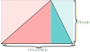

# Visuelle bevis.

Et visuelt bevis går ut på å se i en figur eller i et sett av figurer, at noe *må* være sant.

Eksempelvis, arealet av en trekant må være halvparten av grunnlinjen ganger høyden fordi trekanten fyller ut eksakt halvparten av et rektangel med samme grunnlinje og høyde:

&nbsp;&nbsp;&nbsp;&nbsp;&nbsp;&nbsp;&nbsp;&nbsp;

Her er noen kanskje mer nyttige slike bevis for matematikken i videregående skole:

1. [Kommutativitet for multiplikasjon](./01%20kommutativitet%20for%20multiplikasjon/kommutativitet%20for%20multiplikasjon.md), at
   $a \cdot b = b \cdot a$.

2. [Summen av fortløpende heltall](./02%20sum%20av%20fortløpende%20heltall/sum%20av%20fortløpende%20heltall.md), at $1 + 2 + 3 + \ldots + (n-1) + n = \frac{n \cdot (n + 1)}{2}$.

3. [Andregradsligning](./03%20andregradsligning/andregradsligning.md), at formelen $\frac{-b \ \pm \ \sqrt{b^2 - 4ac}}{2a}$ er å «fullføre kvadratet».

4. Pytagoras lov om sidene i en rettvinklet trekant, at $a^2 + b^2 = c^2$.

5. (Summen av fortløpende potenser?)?
